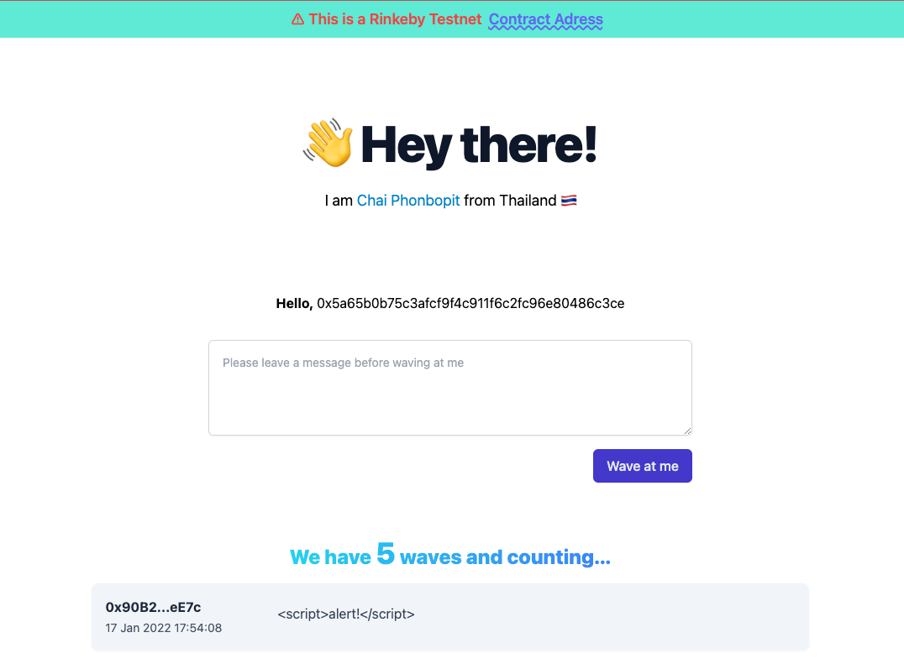

# Wave Portal

Learning Solidity with [Build a Web3 App with Solidity + Ethereum Smart Contract](https://buildspace.so/solidity)




forked from `waveportal-starter` and add some feature includes:

* Vite.js
* TailwindCSS

## Demo

[Wave Portal Demo](https://wave-portal-by-chai.netlify.app/) *Rinkeby Network only*


## Usage

* Setup [Alchemy](https://www.alchemy.com/) and wallet in `.env` file (see `.env.example`)

> Please note: Do not use the REAL wallet, use dev wallet or create new wallet instead.

Install dependencies

```
npx install
```

Run hardhat script

```
npx hardhat run scripts/run.js
npx hardhat run scripts/deploy.js --network <localhost|rinkeby>
```

Run frontend

```
npm run dev

# build
npm run build
```

> Please do your own risk, Don't include any sensitive data.